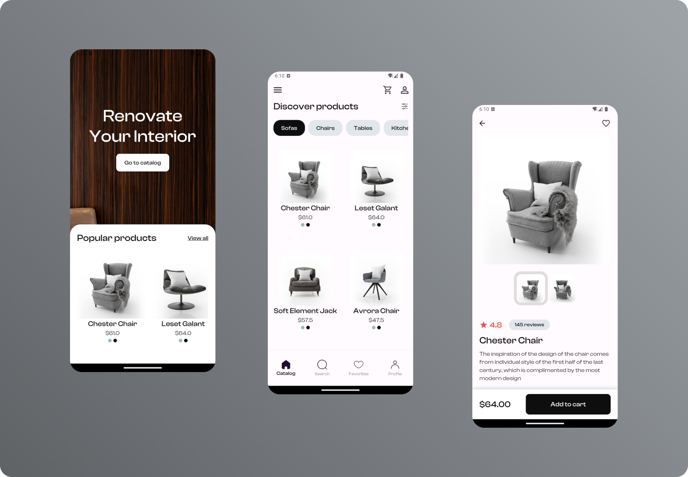
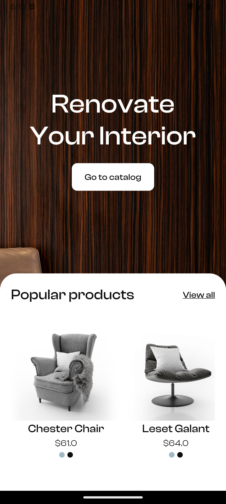
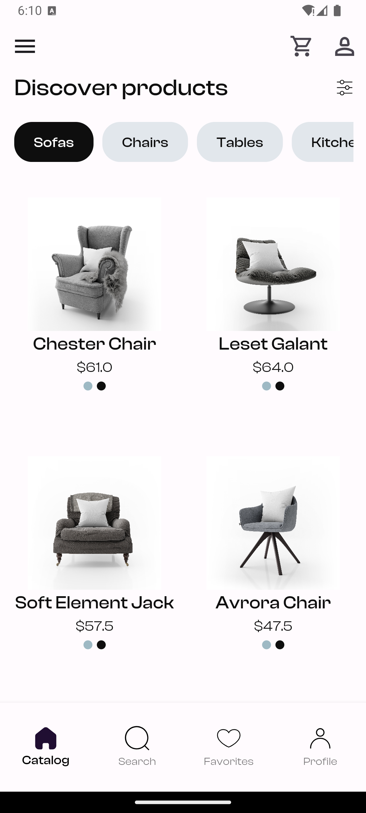
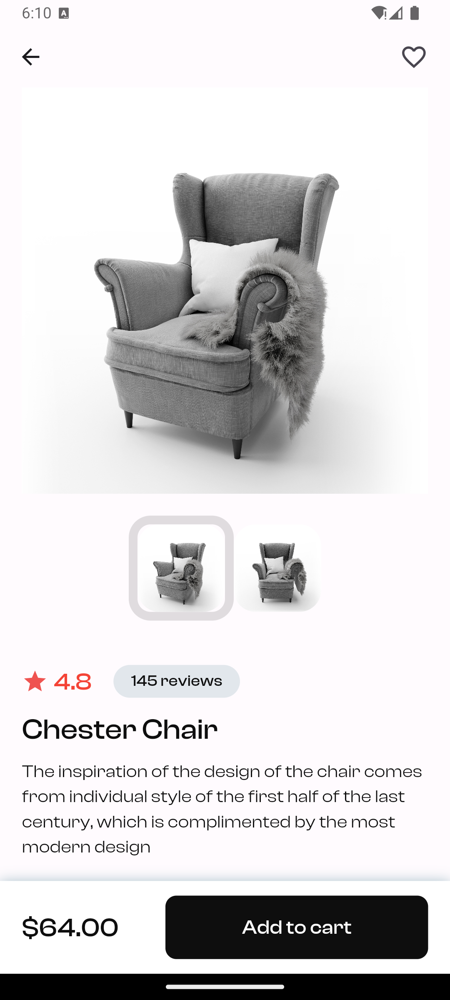

# 🔨ChairShopApp  

Flutter representation of a Furniture Shop app UI i found in <a href='https://dribbble.com/shots/22780260-Ecommerce-App-Design-Concept'>Dribbble</a>. 
**It only consists of 3 screens.**

Star⭐ the repo if you like what you see😉.

## 📸 ScreenShots

| 1 | 2 | 3 |
|------|-------|-------|
||||

## ✨ Prerequisites
* Compatible with any Operating System (e.g., MacOS X, Linux, Windows)
* Requires an IDE with Flutter SDK installed (e.g., IntelliJ, Android Studio, VSCode, etc.)
* Basic familiarity with Dart and Flutter
* Some critical thinking skills 🤓🤓

## 🤓 Author(s)
**Lucky Ekpebe** 

# chairshopapp

A new Flutter project.
